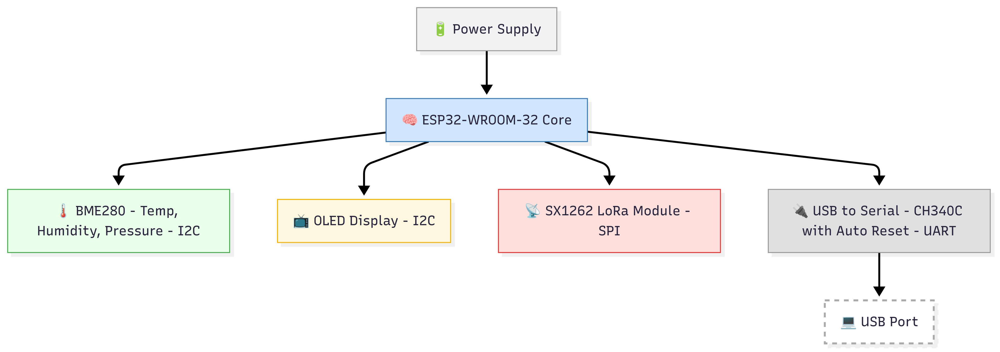

🌿 Smart Environment Monitoring Node  
📡 ESP32-WROOM-32 + LoRa + BME280 + OLED | USB Powered | Custom PCB

──────────────────────────────────────────────

📌 Overview

This project is a compact, power-efficient, and long-range **environment monitoring system** based on the **ESP32-WROOM-32 chip**. It measures temperature, humidity, and pressure using the **BME280 sensor**, displays real-time values on a **0.96” OLED display**, and transmits the data via **LoRa SX1262** for remote monitoring.  

All hardware is designed on a **custom 2-layer PCB** and powered via a **USB Micro-B port**, with built-in USB-to-Serial conversion and auto-upload support for seamless firmware flashing.

---

✨ Project Highlights

• 🔧 Fully custom-designed PCB (2-layer) using KiCad  
• 📡 Long-range LoRa communication using SX1262  
• 🌡 Environmental monitoring using BME280  
• 🖥 Local data display via 0.96” I2C OLED  
• 🔌 USB-powered with CH340C USB-to-Serial interface  
• ⏩ Auto-upload circuit using NPN transistors  
• 🔁 Reset + Boot buttons like ESP32 Dev board  
• 📍Test points for VCC & GND for easy debugging  
• 🔋 AMS1117-based 3.3V regulator (if needed)  

---

## 📌 GPIO Pinout & Connections

| GPIO Pin | Connected To        | Function / Role              |
|----------|---------------------|------------------------------|
| **GPIO 0**   | Q2 (Transistor)        | BOOT (Auto Upload via DTR)    |
| **GPIO 1 (TXD)** | CH340C RXD           | UART Transmission             |
| **GPIO 3 (RXD)** | CH340C TXD           | UART Reception                |
| **GPIO 4**   | SX1262 NSS             | SPI Chip Select (LoRa)       |
| **GPIO 5**   | SX1262 BUSY            | LoRa Busy Status             |
| **GPIO 14**  | SX1262 SCK             | SPI Clock                    |
| **GPIO 18**  | SX1262 MISO            | SPI MISO                     |
| **GPIO 19**  | SX1262 MOSI            | SPI MOSI                     |
| **GPIO 21**  | OLED SDA               | I2C Data (Display)           |
| **GPIO 22**  | OLED SCL               | I2C Clock (Display)          |
| **GPIO EN**  | Q1 (Transistor)        | EN (Auto Reset via RTS)      |
| **GPIO 23**  | SX1262 DIO1            | LoRa Interrupt               |
| **GPIO 16**  | SX1262 DIO2            | LoRa General-Purpose I/O     |
| **GPIO 17**  | BME280 SCK             | SPI Clock (Sensor)           |
| **GPIO 2**   | LED (Optional)         | Debug LED Output             |
| **GPIO 13**  | SX1262 NSS             | SPI Slave Select (LoRa)      |
| **GPIO 12, 15** | (Free or Reserved)     | Available for future use     |

🔍 *See schematic for exact net labels and detailed mapping.*

---

🔍 Use Case Acknowledgement

This project is ideal for:

• Agricultural field condition monitoring  
• Weather stations (indoor or outdoor)  
• Smart home environmental logging  
• Educational IoT demonstrations  
• Smart city sensor node deployment  
• Remote sensing with LoRa infrastructure

---

## 🧭 System Architecture



---

🧩 Component Summary

| No. | Component              | Interface | Description                                  |
|-----|------------------------|-----------|----------------------------------------------|
| 1   | ESP32-WROOM-32         | -         | Main MCU (WiFi, BLE, Dual Core)              |
| 2   | BME280 (SPI)           | SPI       | Temp, Pressure, Humidity sensor              |
| 3   | OLED 0.96” Display     | I2C       | SSD1306, 128x64 pixel display                |
| 4   | SX1262IMLTRT (QFN)     | SPI       | LoRa transceiver (433/868/915MHz)            |
| 5   | AMS1117-3.3V Regulator | Power     | Converts 5V USB to 3.3V (optional)           |
| 6   | CH340C USB to Serial   | UART      | USB programming interface                    |
| 7   | 40MHz Crystal Oscillator| CLK      | ESP32 clock source                           |
| 8   | Push Buttons (2x)      | GPIO/EN   | Boot and Reset functionality                 |
| 9   | LED + Resistor         | Power     | Power-on indicator                           |
| 10  | Capacitors (0.1µF, 10µF)| Power    | Decoupling & filtering                       |
| 11  | Test Points (TP1/TP2)  | -         | For debugging (3.3V and GND)                 |
| 12  | Micro USB Port         | Power     | Power + Serial communication                 |
| 13  | Resistors (10k, 1k)    | Logic     | Pull-ups and transistor base resistors       |
| 14  | NPN Transistors (x2)   | Auto Upload | Connected to DTR/RTS                        |
| 15  | Conn_01x2 / 01x4 / 01x8| Header    | GPIO/I2C/Power breakout (optional)           |

---

💾 Firmware Summary

• Platform: Arduino Framework  
• Libraries:
  - `Adafruit_BME280` (SPI)
  - `U8g2lib` / `Adafruit_SSD1306`
  - `RadioLib` or `LoRa` for SX1262
• Logic:
  - Read sensor values → Display on OLED → Send via LoRa
• Auto-upload handled via CH340C + transistor toggling of IO0 and EN

---

🧪 Test Points

| Label | Connected To | Use                      |
|-------|--------------|---------------------------|
| TP1   | 3.3V         | Voltage test/debug        |
| TP2   | GND          | Ground continuity check   |

---

📦 Folder Structure

```
Smart-Environment-Monitoring-Node/
│
├── SCHEMATIC/
│   ├── Smart_Env_monitoring_Node.kicad_sch
│   ├── Smart_Env_monitoring_Node.pdf
│  
├── Backup_ZIP
│
├── PCB/
│   ├──  Smart_Env_monitoring_Node.kicad_pcb
│   ├──  Smart_Env_monitoring_Node.kicad_pro
│   ├──  Smart_Env_monitoring_Node.csv
│   ├── Gerber_Files/
│   ├── F_Cu.gbr
│   ├── B_Cu.gbr
│   ├── Edge_Cuts.gbr
│   ├── Drill.drl
│   └── ...etc
│
├── Firmware/
│   └── main.ino 
│
├── Libraries/
│   ├── COMPONENTS_DOWNLOADED/
│   └── MY_LIBRARY_MODIFIED.pretty/
│
├── Images/
│   ├── 3D_View.png
│   ├── Top_Layout.png
│   ├── Bottom_Layout.png
│   └── System_Architecture.png
│
├── README.md
└── .gitignore
```


---

📐 PCB Design Summary

• Software: KiCad 7.0  
• Layers: 2 (Top & Bottom)  
• Antenna zone: Keep-out area maintained  
• Crystal zone: No trace below (as per layout best practices)  
• Ground pour: Yes, with via stitching  
• Auto-upload near CH340C  
• I2C lines shared between OLED and future I2C sensors

---

📌 Optional Headers

| Header     | Size | Description                    |
|------------|------|--------------------------------|
| Conn_01x2  | 2-pin | External battery connection    |
| Conn_01x4  | 4-pin | I2C expansion header           |
| Conn_01x8  | 8-pin | GPIO access (debug/expansion) |

---

🔮 Future Improvements

• Add onboard Li-ion battery charging (TP4056)  
• Use low-dropout regulator instead of AMS1117  
• Enable I2C/SPI switch for BME280  
• Add buzzer or notification LED  
• Add deep sleep mode for power efficiency  
• Add mobile enclosure + mounting holes

---

📜 License

Licensed under the MIT License.  
Feel free to use, modify, and share — just give credit. 

---

🤝 Acknowledgements

This project is inspired by real-world smart sensing requirements and open hardware communities. Thanks to Espressif Systems, Adafruit, and the KiCad team for empowering makers with tools and documentation.

---

📬 Contact / Contribution

• Found something useful? Leave a ⭐ on GitHub.  
• Found a bug or want to improve? Fork and PRs are welcome.  
• Reach out for collaboration or questions!

Let’s make sensing smarter, together. 🌍
